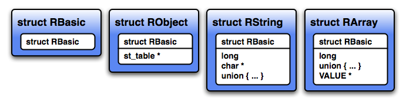
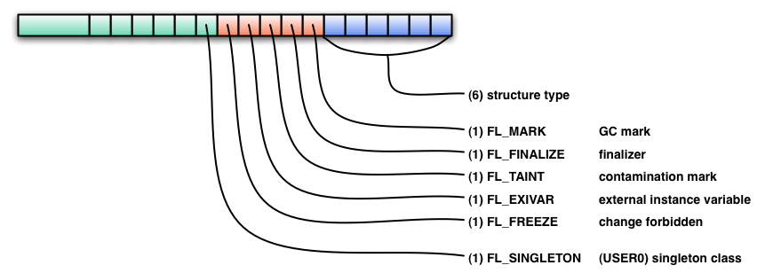
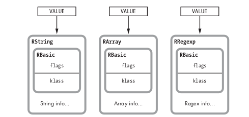
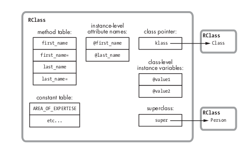
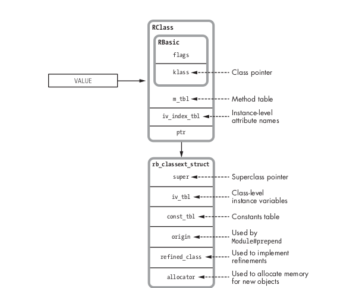
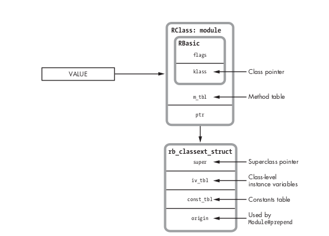

## Sobre object_id

```bigquery
obj = Object.new      #=> #<Object:0x00007fb7981e4068> 
obj.object_id         #=> 70213253931060 
obj.object_id << 1    #=> 140426507862120 
_.to_s(16)            #=> "7fb7981e4068"
```

```bigquery
false.object_id       #=> 0
true.object_id        #=> 2
nil.object_id         #=> 4
1.object_id           #=> 3
2.object_id           #=> 5
10.object_id          #=> 21
```

en Ruby < 2.7 se usaba una funcion que es el nonspecial_obj_id https://github.com/ruby/ruby/blob/27958c2bd64b27d529f81a130bd488ccc6b9b1d4/gc.c#L3301 que si tenes la siguiente address en MRI

object  oooooooooooooooooooooooooooooo00        = 0 (mod sizeof(RVALUE))

en el entorno de ruby, el object_id se representa como

object   oooooooooooooooooooooooooooooo0        o...o % A = 0

por eso se hace el bitwise left de un bit solamente para hacer el matcheo entre object_id y puntero de memoria en C


```bigquery
*                32-bit VALUE space
     *          MSB ------------------------ LSB
     *  false   00000000000000000000000000000000
     *  true    00000000000000000000000000000010
     *  nil     00000000000000000000000000000100
     *  undef   00000000000000000000000000000110
     *  symbol  ssssssssssssssssssssssss00001110
     *  object  oooooooooooooooooooooooooooooo00        = 0 (mod sizeof(RVALUE))
     *  fixnum  fffffffffffffffffffffffffffffff1
     *
     *                    object_id space
     *                                       LSB
     *  false   00000000000000000000000000000000
     *  true    00000000000000000000000000000010
     *  nil     00000000000000000000000000000100
     *  undef   00000000000000000000000000000110
     *  symbol   000SSSSSSSSSSSSSSSSSSSSSSSSSSS0        S...S % A = 4 (S...S = s...s * A + 4)
     *  object   oooooooooooooooooooooooooooooo0        o...o % A = 0
     *  fixnum  fffffffffffffffffffffffffffffff1        bignum if required
     *
     *  where A = sizeof(RVALUE)/4
     *
     *  sizeof(RVALUE) is
     *  20 if 32-bit, double is 4-byte aligned
     *  24 if 32-bit, double is 8-byte aligned
     *  40 if 64-bit
```

https://github.com/ruby/ruby/blob/a0c7c23c9cec0d0ffcba012279cd652d28ad5bf3/gc.c#L3803

donde se usa la funcion cached_object_id que al parecer es una direccion pero interna que tiene el gc, pero aun existe la otra funcion y se la usa aun en el to_s cuando imprimis una instancia de un objeto, asi que tengo que ver como puedo llegar a llamarlo, si es que hay algun metodo de ruby nuevo en 2.7

https://github.com/ruby/ruby/blob/27958c2bd64b27d529f81a130bd488ccc6b9b1d4/gc.c#L3288

## Structs


- `struct RObject`	all things for which none of the following applies
- `struct RClass`	class object
- `struct RFloat`	small numbers
- `struct RString`	string
- `struct RArray`	array
- `struct RRegexp`	regular expression
- `struct RHash`	hash table
- `struct RFile`	`IO`, `File`, `Socket`, etc…
- ` struct RData`	all the classes defined at C level, except the ones mentioned above
- `struct RStruct`	Ruby’s `Struct` class
- `struct RBignum`	big integers



```bigquery
 290  struct RBasic {
 291      unsigned long flags;
 292      VALUE klass;
 293  };

(ruby.h)
```



## String and Arrays



```bigquery
struct RString {
    struct RBasic basic;
    union {
	struct {
	    long len;
	    char *ptr;
	    union {
		long capa;
		VALUE shared;
	    } aux;
	} heap;
	char ary[RSTRING_EMBED_LEN_MAX + 1];
    } as;
};
```

```bigquery
#define RSTRING_EMBED_LEN_MAX RSTRING_EMBED_LEN_MAX
#define RSTRING_FSTR RSTRING_FSTR
enum ruby_rstring_flags {
    RSTRING_NOEMBED = RUBY_FL_USER1,
    RSTRING_EMBED_LEN_MASK = (RUBY_FL_USER2|RUBY_FL_USER3|RUBY_FL_USER4|
			      RUBY_FL_USER5|RUBY_FL_USER6),
    RSTRING_EMBED_LEN_SHIFT = (RUBY_FL_USHIFT+2),
    RSTRING_EMBED_LEN_MAX = (int)((sizeof(VALUE)*3)/sizeof(char)-1),
    RSTRING_FSTR = RUBY_FL_USER17,

    RSTRING_ENUM_END
};
```


```bigquery
struct RArray {
    struct RBasic basic;
    union {
	struct {
	    long len;
	    union {
		long capa;
		VALUE shared;
	    } aux;
	    const VALUE *ptr;
	} heap;
	const VALUE ary[RARRAY_EMBED_LEN_MAX];
    } as;
};
```

## Classes and Modules





